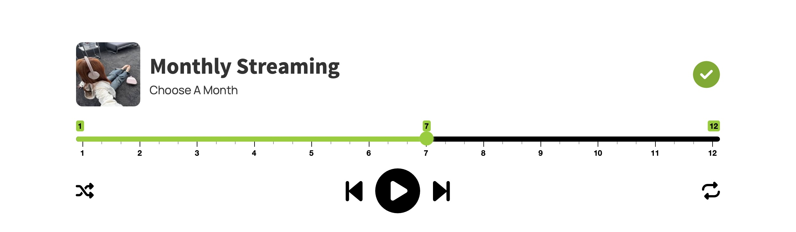
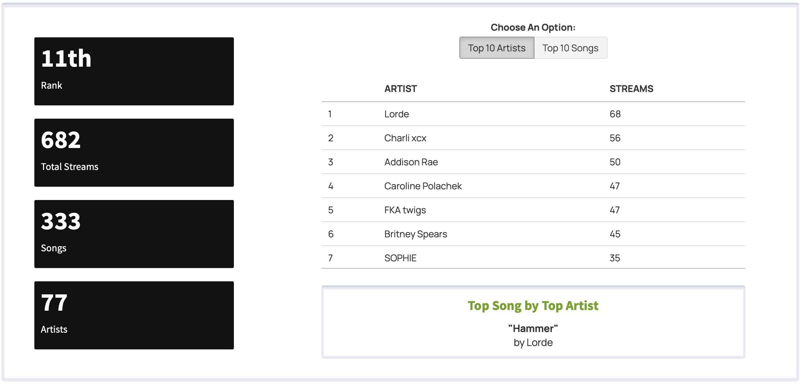
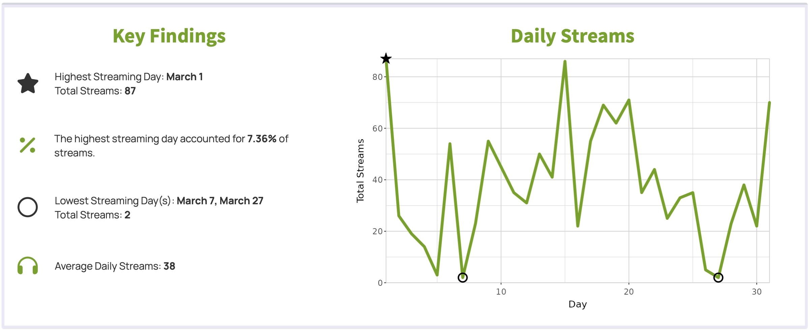
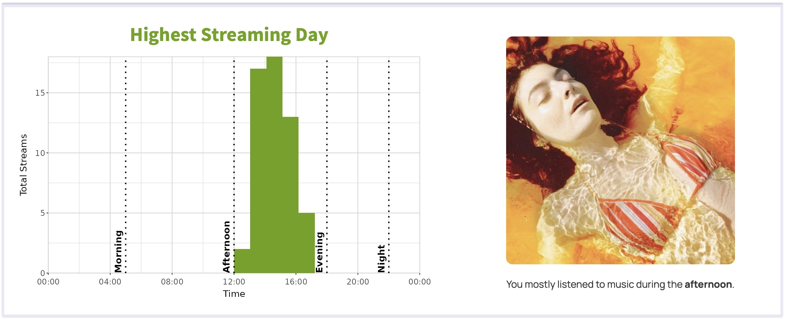

# Spotify Wrapped

<p align="center">
  
  <br>
  <em>Kyle MacLachlan as Lorde</em> 
</p>

## About

This project is inspired by the iconic Spotify Wrapped. For 2025, I decided to take a closer look at my streaming data month-by-month to highlight my top artists, favorite songs, and listening habits.

- Shiny dashboard
- Mobile-responsive user interface
- Data visualization and communication

## Repository Structure

```bash
spotify-wrapped
├── README.md
├── .gitignore
├── analysis
│   ├── functions
│   ├── fresh theme dashboard
│   ├── spotify_wrapped.qmd
│   └── spotify_wrapped.html
└── shinydashboard
    ├── data
    ├── text
    ├── www
    ├── global.R
    ├── server.R
    └── ui.R
```

## Data

The data was collected using a third-party API, IFTTT. This service allows Spotify users to connect Spotify with Google Sheets to automatically log information about each song streamed.

How to access the data:
```{r}
# load packages
library(here)
library(googlesheets4)
```
```{r}
# read data
raw_data <- read_sheet("https://docs.google.com/spreadsheets/d/1U2XrypJcbxnK-hb4GnnqcOejY00HU1kcCVIfWHB_Q7A/edit?usp=sharing")
```
```{r}
# source cleaning function
source(here("analysis", "functions", "clean_data.R"))

# clean data
spotify_data <- clean_data(raw_data)
```
The processed data is available for download in the `data` subfolder of the shinydashboard.

## Shiny Dashboard Preview


The customized sliderInput, styled to resemble the Spotify streaming platform, allows users to select a numeric month. Adjusting the slider dynamically displays the corresponding monthly summary.



The first box of the monthly summary presents the selected month’s rank relative to other months, total streams, number of songs listened to, and number of artists listened to using valueBoxes. It also includes a data table showing the top 10 artists or songs for the month, which can be toggled using the radioGroupButtons at the top.



*insert text*



*insert text*

## References

Torres, M. (2025). *spotify_wrapped* [Google Sheets spreadsheet]. https://docs.google.com/spreadsheets/d/1U2XrypJcbxnK-hb4GnnqcOejY00HU1kcCVIfWHB_Q7A

## Acknowledgements

This project could not have been done without the platforms Spotify and IFTTT.
